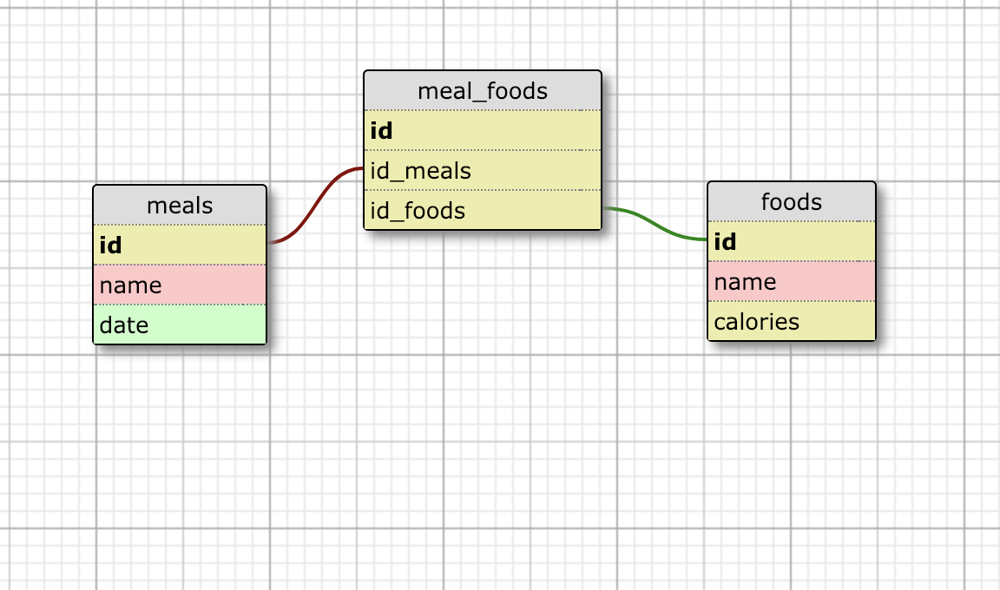

[](https://waffle.io/hbellows/quantifiedSelfApi)
[](https://travis-ci.org/hbellows/quantifiedSelfApi)

---
## Introduction
This is a small API that with meals and foods resources that, when consummed by a front end application, will allow a user to track meals, foods, and calories.  Foods can be displayed indvidually and as part of one of four meals: breakfast, lunch, dinner, snack.  In addition, the user can enter new foods, indvidually and by meal, to be stored in the database, as well as delete individual foods, or foods associated with a meal.

To see how the app was planned and executed, and to see issues still in progress, visit it's project board [here](https://waffle.io/hbellows/quantifiedSelfApi), or by clicking the waffle banner above.

---
## Initial Setup
1. Clone a copy of this repository to your local machine
2. Run `npm install` to install dependencies
3. Run `node server.js` and navigate to `localhost:3000/` to connect to the endpoints locally
4. Or, use the deployed version of this app by visiting [here](https://quantified-self-api-1.herokuapp.com/)

---
## How to Use
These are the currently available endpoints, and their responses, contained in this application:


### Food Endpoints:
1. GET /api/v1/foods
  - Returns all foods currently in the database
  - Each individual food will be returned in the following format:
  ```
  {
      "id": 1,
      "name": "Banana",
      "calories": 150
  },
  ```
2. GET /api/v1/foods/:id
  - Returns the food object with the specific :id you’ve passed in or 404 if the food is not found

3. POST /api/v1/foods
  - Allows creating a new food with the parameters:
  ```
  { "food": { "name": "Name of food here", "calories": "Calories here"} }
  ```
  - If food is successfully created, the food item will be returned. If the food is not successfully created, a 400 status code will be returned.  
  - Both name and calories are required fields.

4. PATCH /api/v1/foods/:id
  - Allows one to update an existing food with the parameters:
  ```
  { "food": { "name": "Mint", "calories": "14"} }
  ```
  - If food is successfully updated (name and calories are required fields), the food item will be returned. 
  - If the food is not successfully updated, a 400 status code will be returned.

5. DELETE /api/v1/foods/:id
  - Will delete the food with the id passed in and return a 204 status code. If the food can’t be found, a 404 will be returned.

### Meal Endpoints:
1. GET /api/v1/meals
  - Returns all the meals in the database along with their associated foods
  - If successful, this request will return a response in the following format:
  ```
  [
      {
          "id": 1,
          "name": "Breakfast",
          "foods": [
              {
                  "id": 1,
                  "name": "Banana",
                  "calories": 150
              },
              {
                  "id": 6,
                  "name": "Yogurt",
                  "calories": 550
              },
              {
                  "id": 12,
                  "name": "Apple",
                  "calories": 220
              }
          ]
      },
      {
          "id": 2,
          "name": "Snack",
          "foods": [
              {
                  "id": 1,
                  "name": "Banana",
                  "calories": 150
              },
              {
                  "id": 9,
                  "name": "Gum",
                  "calories": 50
              },
              {
                  "id": 10,
                  "name": "Cheese",
                  "calories": 400
              }
          ]
      },
      {
          "id": 3,
          "name": "Lunch",
          "foods": [
              {
                  "id": 2,
                  "name": "Bagel Bites - Four Cheese",
                  "calories": 650
              },
              {
                  "id": 3,
                  "name": "Chicken Burrito",
                  "calories": 800
              },
              {
                  "id": 12,
                  "name": "Apple",
                  "calories": 220
              }
          ]
      },
      {
          "id": 4,
          "name": "Dinner",
          "foods": [
              {
                  "id": 1,
                  "name": "Banana",
                  "calories": 150
              },
              {
                  "id": 2,
                  "name": "Bagel Bites - Four Cheese",
                  "calories": 650
              },
              {
                  "id": 3,
                  "name": "Chicken Burrito",
                  "calories": 800
              }
          ]
      }
  ]
  ```

2. GET /api/v1/meals/:meal_id/foods
 - Returns all the foods associated with the meal with an id specified by :meal_id or a 404 if the meal is not found
 - If successful, this request will return a response in the following format:
  ```
  {
      "id": 1,
      "name": "Breakfast",
      "foods": [
          {
              "id": 1,
              "name": "Banana",
              "calories": 150
          },
          {
              "id": 6,
              "name": "Yogurt",
              "calories": 550
          },
          {
              "id": 12,
              "name": "Apple",
              "calories": 220
          }
      ]
  }
  ```

3. POST /api/v1/meals/:meal_id/foods/:id
 - Adds the food with :id to the meal with :meal_id
 - This creates a new record in the MealFoods table to establish the relationship between this food and meal. 
 - If the meal/food cannot be found, a 404 will be returned.
 - If successful, this request will return a status code of 201 with the following body:
  ```
  {
      "message": "Successfully added FOODNAME to MEALNAME"
  }
  ```

4. DELETE /api/v1/meals/:meal_id/foods/:id
 - Removes the food with :id from the meal with :meal_id
 - This deletes the existing record in the MealFoods table that creates the relationship between this food and meal. 
 - If the meal/food cannot be found, a 404 will be returned.
 - If successful, this request will return:
  ```
  {
      "message": "Successfully removed FOODNAME to MEALNAME"
  }
  ```
---
## Known Issues
Currently, the application has no authentication functionality, so it's best used for a personal application.  
Future iterations of this project will it be accessed by multiple users.

---
## Running Tests
Simply run `mocha --exit` to run the test suite. 
Or, run `npm test` to run the test suite with additional test coverage details

---
## How to Contribute
Suggestions for improvements or bug fixes can be made by forking and cloning a copy of this repository and submitting a pull request.

---
## Core Contributors
This application is part of the Turing School's Module 4 Backend Engineering program.  This is pair project submitted by [William Fischer](@wfischer42) and [Harper Bellows](@hbellows).

---
## Schema Design



---
## Tech Stack List
 - JavaScript
 - Node.js
 - Express
 - Knex
 - Postgres
 - Mocha
 - Chai
---